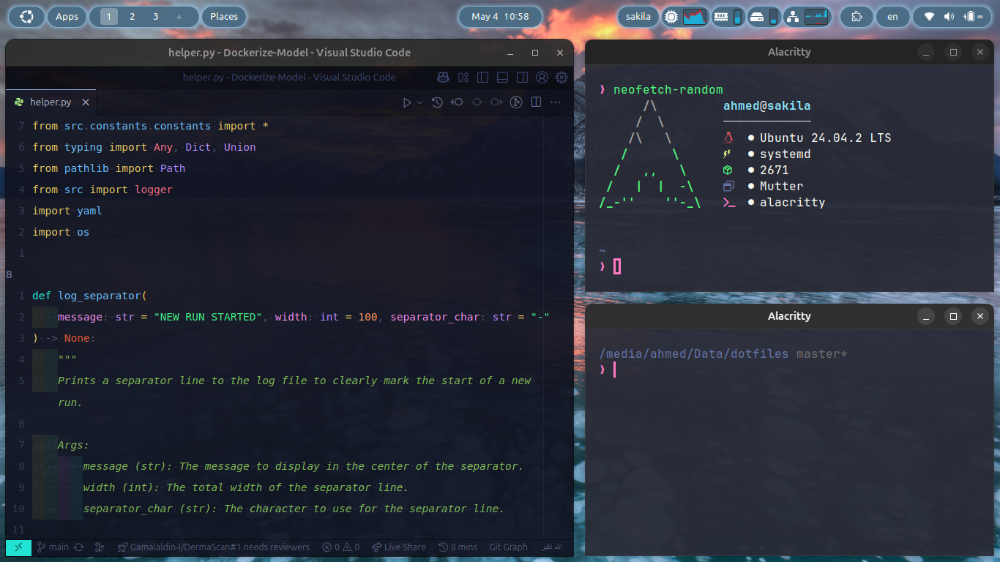
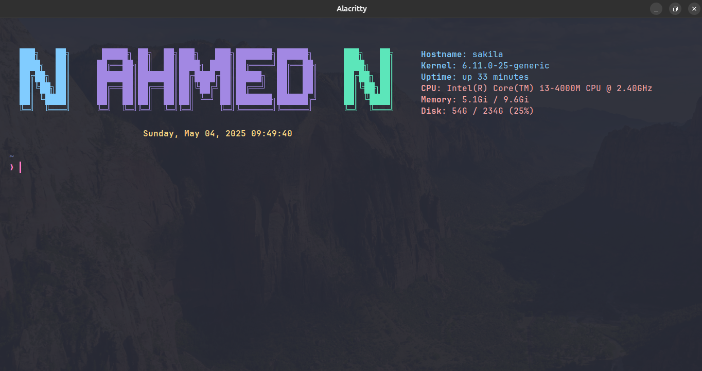
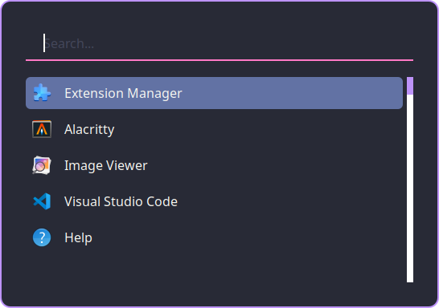

# <p align="center">Dotfiles</p>



This repository contains configuration files, scripts, and resources for customizing and automating your Linux environment. Below is an overview of the project structure:

## Project Structure

- **.config/**
  - `alacritty/`: Configuration for the Alacritty terminal emulator.
  - `neofetch/`: Configuration for Neofetch, a system information tool.
  - `rofi/`: Configuration for the Rofi application launcher.
  - `zsh/`: Configuration for Zsh shell.

- **images**
  - `alacritty.png`: Screenshot of the Alacritty terminal.
  - `full.png`: Full desktop screenshot.
  - `rofi.png`: Screenshot of the Rofi launcher.

- **scripts/**
  - `neofetch/`
    - `neofetch.sh`: Script for displaying system information.
  - `zsh/`
    - `welcome.sh`: Script for customizing the Zsh shell startup.

# Screenshots

<details>
  <summary>Alacritty - ZSH</summary>
  
</details>

<details>
  <summary>Rofi </summary>
  
</details>

<details>
  <summary>More Screenshots </summary>
  
</details>

## Usage

1. Clone the repository:

   ```bash
      git clone https://github.com/A-A7med-i/dotfiles.git
   ```

2. Explore the configuration files and scripts to customize your environment.

## Enhancements

- **Backup and Restore**: Added instructions for backing up and restoring original configurations.
- **Dependency Installation**: Added a script to automate the installation of required dependencies.
- **Update Script**: Added a script to update the dotfiles repository and reapply configurations.

## Troubleshooting

If you encounter issues during setup, consider the following:

1. Ensure you have the necessary permissions to create symbolic links.
2. Verify that the required dependencies (e.g., Alacritty, Neofetch, Rofi, Zsh) are installed.
3. Check the logs for error messages and resolve any conflicts.

## Restore Original Configuration

To restore your original configuration, follow these steps:

1. Navigate to the backup directory (if created during setup).
2. Copy the original configuration files back to their respective locations.

```bash
cp -r ~/dotfiles_backup/.config/* ~/.config/
```

3. Restart your terminal or application to apply the changes.

## License

This project is licensed under the MIT License.
